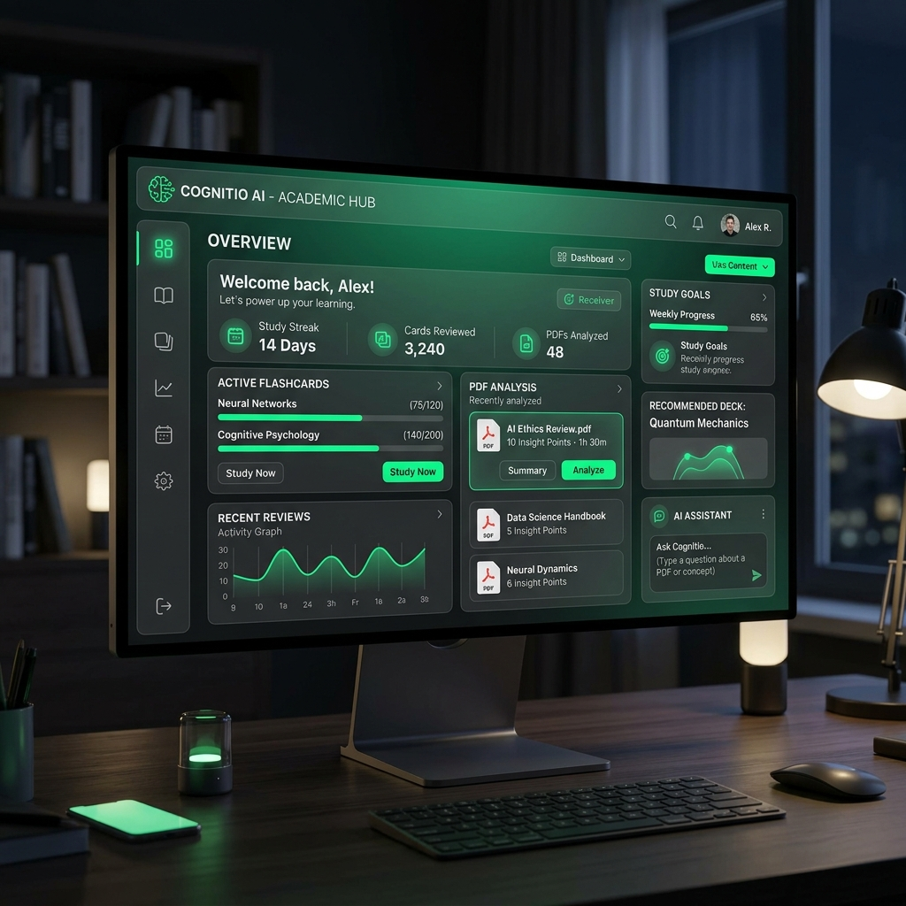

# 🚀 Professional Portfolio | Luan Estifer

Modern, high-performance portfolio developed to showcase software engineering projects, technical skills, and professional trajectory.



## 💎 Features

- **Selected Projects Grid**: Highlights the top 6 repositories with custom-generated high-quality thumbnails.
- **Repository Archive**: Interactive section listing over 15+ projects with live search and category filtering (Python, JavaScript, Django, etc.).
- **Premium UI/UX**:
    - **Glassmorphism**: Elegant blur effects and semi-transparent layers.
    - **Reveal Animations**: Content smoothly fades into view on scroll.
    - **Typing Effect**: Dynamic hero subtitle.
    - **Scroll Progress**: Visual indicator at the top of the page.
    - **Neon Aesthetic**: Dark mode with vibrant green accents.
- **Contact Integration**: 
    - One-click email copy functionality.
    - Direct links to LinkedIn and GitHub.
- **Responsive Design**: Fully optimized for mobile, tablet, and desktop.

## 🛠️ Tech Stack

- **Frontend**: HTML5, CSS3 (Vanilla), JavaScript (ES6+).
- **Design**: FontAwesome Icons, Google Fonts (Inter, Fira Code).
- **Assets**: Structured organization in `/assets` directory.

## 📁 Project Structure

```text
├── index.html          # Main landing page
├── curriculo.html      # Digital CV / Resume page
├── assets/
│   ├── images/         # Project thumbnails and screenshots
│   └── docs/           # CV PDF and other documents
└── README.md           # Documentation
```

## 🚀 How to Run Locally

1. Clone the repository:
   ```bash
   git clone https://github.com/Zsubzeroz/Portifolio.git
   ```
2. Open `index.html` in your favorite browser.

---
**Developed by Luan Estifer // 2026**